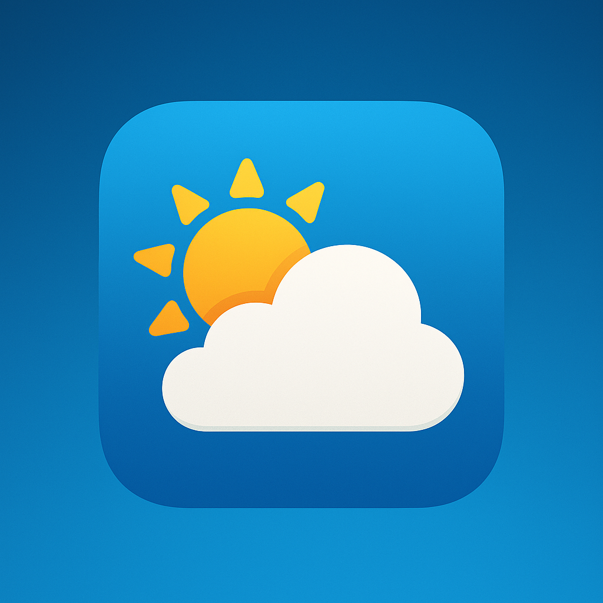

# SkyLens

<p align="center">
  
</p>

<p align="center">
SkyLens is a universal iOS weather app built with SwiftUI and MVVM architecture that provides current weather information for selected Canadian cities.
</p>

## Features

- **Real-time Weather Data**: Display current weather conditions for 5 Canadian cities
- **Unit Switching**: Toggle between Celsius (°C) and Fahrenheit (°F)
- **Dynamic UI**: Background color adapts to temperature
- **Contact Form**: Form with field validation for user feedback
- **Universal App**: Responsive design works on both iPhone and iPad
- **Modern UI**: Glass-morphism design with smooth animations

## Requirements

- Xcode 15.0+
- Swift 5.10+
- iOS 16.0+

## Getting Started

### Build and Run

1. Clone the repository
2. Open `SkyLens.xcodeproj` in Xcode
3. Select your target device or simulator
4. Build and run (⌘+R)

No special setup, environment variables, or external dependencies are required.

### Running Tests

To run all tests:

1. In Xcode, press ⌘+U to run all tests

You can also run individual test suites by selecting the specific test file and clicking the play button next to the
test class or method.

## Project Structure

- **Models**: Data structures for the app
- **Views**: SwiftUI views for the UI
- **ViewModels**: Business logic and state management
- **Services**: Networking and storage services

## Technical Details

### Architecture

- **MVVM**: Separates UI (Views) from business logic (ViewModels) and data (Models)
- **Protocol-first design**: Services are defined as protocols for better testability
- **Async/await**: Modern Swift concurrency for network operations

### API Endpoints

The app uses the following weather API endpoints:

- **Metric**: `https://weatherapi.pelmorex.com/api/v1/observation/placecode/[CITY_CODE]?unit=metric`
- **Imperial**: `https://weatherapi.pelmorex.com/api/v1/observation/placecode/[CITY_CODE]?unit=imperial`

Supported city codes:

- Toronto: CAON0696
- Montreal: CAON0423
- Ottawa: CAON0512
- Vancouver: CABC0308
- Calgary: CAAB0049

### State Management

- `@Published` properties in ViewModels for reactive UI updates
- Error handling with typed errors and user-friendly messages
- UserDefaults for minimal persistence of user preferences

### Testing

- Unit tests for ViewModels, Services, and validation logic
- UI tests for basic app flow verification
- Mock services for dependency injection during testing

## Assumptions and Limitations

- The app relies on URLCache for HTTP caching, with no custom caching implemented
- Contact form submission is simulated (no actual backend integration)
- Error handling is basic but user-friendly
- Focus is on architectural correctness rather than UI polish

## Modern Swift Features

- **Async/await**: For clean, structured concurrency
- **@MainActor**: For proper UI thread management
- **Combine**: For reactive programming with @Published properties

## Protocol-First Design

```swift
protocol NetworkService {
    func fetchWeather(for city: City, unit: TemperatureUnit) async throws -> WeatherInfo
}
```

## Error Handling

```swift
enum WeatherError: Error {
    case networkError(Error)
    case decodingError(Error)
    case invalidResponse
    case invalidURL
    
    var userFriendlyMessage: String { ... }
}
```

## State Management

```swift
enum ViewState {
    case loading
    case loaded
    case error(String)
}
```

## API Information

The app uses the Weather Network API with the following endpoints:

- **Metric**: `https://weatherapi.pelmorex.com/api/v1/observation/placecode/[CITY_CODE]?unit=metric`
- **Imperial**: `https://weatherapi.pelmorex.com/api/v1/observation/placecode/[CITY_CODE]?unit=imperial`

### Supported Cities

| City      | Code     |
|-----------|----------|
| Toronto   | CAON0696 |
| Montreal  | CAON0423 |
| Ottawa    | CAON0512 |
| Vancouver | CABC0308 |
| Calgary   | CAAB0049 |

## Design Decisions

### Minimalist Persistence

- UserDefaults for storing user preferences (last selected city and unit)
- No complex database setup needed for this scope

### Efficient Networking

- Built-in URLCache for HTTP response caching
- No additional caching layer to keep the design simple

### UI Approach

- Glass-morphism design for a modern look
- Dynamic backgrounds that respond to temperature
- Responsive layouts for all device sizes

## Future Improvements

- Weather forecast (multiple days)
- Location-based weather detection
- More detailed weather information (wind, humidity, etc.)
- Dark mode theme optimization
- Localization for multiple languages
